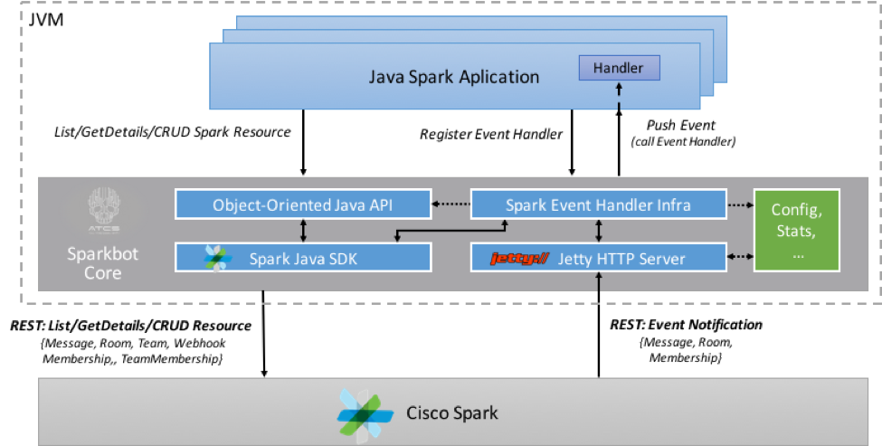
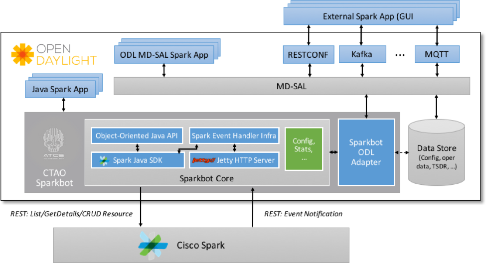

# Sparkbot
## Overview
Sparkbot is a tool kit to built Java-based Bots for the Spark collaboration platform. It is built on top of [spark-java-sdk] (https://github.com/ciscospark/spark-java-sdk). SparkBot extends park-java-sdk in two ways:
* It provides an object-oriented facade to the SPARK REST API, which models Spark resources, such as messages, rooms, or teams, as Java DTOs and Spark CRUD / List/ GetDetails operations on resources as typed Java interfaces. This facade is implemented as a thin layer on top of spark-java-sdk. 
* It provides an HTTP server with an event handler system that allows an app to register for webhook events and to handle webhook events coming from Spark. An application registers a handler for a desired event type, which then gets invoked when the event is received from Spark. 

The two above component constitute the core of the Sparkbot system, as shown in the following figure:




Sparkbot also provides integration of the core with the [OpenDaylight](https://wiki.opendaylight.org/view/Main_Page) (ODL) application development platform. ODL provides to app developers and users many useful supporting features, such as Karaf OSGI with a user console/CLI, a build system, logging, database capability for config data, automated REST API generation for managing the, clustering/HA, and a variety of plugins that a Spark app can use to connect to a variety of external systems. ODL also provides a basic auto-rendered GUI for configuraton and testing.  

The integration of Sparkbot core with ODL is shown in the following figure:



Note, however, that the Sparkbot core is not dependent on anything in ODL, it could be used as a library in any Java-based system. 

## Repository Structure
The folders in the Sparkbot project are as follows:
* **images**: contains images for figures in this README file.
* [**sparkjavasdk**](https://github.com/CiscoDevNet/odl-sparkbot/tree/master/sparkjavasdk): a slightly modified version of the [Spark Java SDK] (https://github.com/ciscospark/spark-java-sdk). You have to build this Sparkbot SDK version and install it in your local maven repo for Sparkbot to compile. Changes were made to the Spark API ([Spark.java](https://github.com/CiscoDevNet/odl-sparkbot/tree/master/sparkjavasdk/src/main/java/com/ciscospark/Spark.java)) and implementation ([SparkImpl.java](https://github.com/CiscoDevNet/odl-sparkbot/tree/master/sparkjavasdk/src/main/java/com/ciscospark/SparkImpl.java)), where we extended Spark to return a generic Spark [RequestBuilder](https://github.com/CiscoDevNet/odl-sparkbot/tree/master/sparkjavasdk/src/main/java/com/ciscospark/RequestBuilder.java). 
* [**sparkbot**](https://github.com/CiscoDevNet/odl-sparkbot/tree/master/sparkbot): contains the Sparkbot core and a buildable ODL-based Bot which is both an example of how to use Sparkbot core code and skeleton for a user’s Bot. Moreover, the example code is hooked up to a GUI where a user can drive it from a browser and to a REST API where a user can drive it from Postman or Curl. Descriptions of the GUI and the REST API will be provided in the documentation. The buildable ODL Bot is basically an OpenDaylight mini-distribution containing the Sparkbot core, the example code and a skeleton for a user Bot.  The user Bot skeleton can be used by application developers to build their own Bots. 

  The structure of the sparkbot folder follows the convention for an [ODL-based application](https://wiki.opendaylight.org/view/OpenDaylight_Controller:MD-SAL:Startup_Project_Archetype). The structure of the folder is as follows:
  ```
  ├── api
  │   ├── pom.xml
  │   └── src
  │       └── main
  │           └── yang
  ├── app
  │   ├── src
  │       └── main
  │           ├── java
  │               └── com
  │                   └── cisco
  │                       └── ctao
  │                           └── sparkbot
  │                               └── application
  │                                   └── SparkbotAppProvider.java
  ├── artifacts
  ├── cli
  ├── features
  ├── impl
  │   ├── pom.xml
  │   └── src
  │       └── main
  │           ├── java
  │               └── com
  │                   └── cisco
  │                       └── ctao
  │                           └── sparkbot
  │                               ├── core
  │                               │   ├── testhandlers
  │                               │   └── webhookserver
  │                               ├── impl
  │                               └── odladapter
  ├── it
  ├── karaf
  └── src
  ```
  The interesting top level folders are:
  * **api**: The [`api/src/main/yang`](https://github.com/CiscoDevNet/odl-sparkbot/tree/master/sparkbot/api/src/main/yang) folder contains yang models that define the Bot's REST and MD-SAL Java APIs
  * **app**: The [`app/src/main/java/com/cisco/ctao/sparkbot/application/`](https://github.com/CiscoDevNet/odl-sparkbot/tree/master/sparkbot/app/src/main/java/com/cisco/ctao/sparkbot/application) folder contains the code for the example Hello World application. The `run()` method in [`HelloWorldApp.java`](https://github.com/CiscoDevNet/odl-sparkbot/blob/master/sparkbot/app/src/main/java/com/cisco/ctao/sparkbot/application/HelloWorldApp.java) contains examples of how to use the Sparbot API and the Sparkbot Event Handler. Sparkbot application code created by users/app developers should also reside in this folder. 
  * **impl**: The [`impl/src/main/java/cisco/ctao/sparkbot`](https://github.com/CiscoDevNet/odl-sparkbot/tree/master/sparkbot/impl/src/main/java/com/cisco/ctao/sparkbot) folder is where the Sparkbot code resides. The folder contains   the Sparkbot core and the Sparkbot ODL adapter. The [Sparkbot core](https://github.com/CiscoDevNet/odl-sparkbot/tree/master/sparkbot/impl/src/main/java/com/cisco/ctao/sparkbot/core)  folder is where the implementations of the Sparkbot Object-Oriented API, the webhook server reside and the hte Spark event handler framework. This folder also holds examples of handlers for Spark Message, Membership and Room events. The [Sparkbot ODL adaptor](https://github.com/CiscoDevNet/odl-sparkbot/tree/master/sparkbot/impl/src/main/java/com/cisco/ctao/sparkbot/odladapter)  folder contains code that integrates the Sparkbot core and the user applications into OpenDaylight.

## Downloading, Building and Running Sparkbot
### Prerequisites:
* Java 8
* [Apache Maven](https://maven.apache.org/) 3.3.X or later (3.3.9 preferred)
* Set up your development environment for building OpenDaylight applications as outlined [here](https://wiki.opendaylight.org/view/GettingStarted:Development_Environment_Setup). In particular, make sure that the [settings for your local Maven repo](https://wiki.opendaylight.org/view/GettingStarted:Development_Environment_Setup#Edit_your_.7E.2F.m2.2Fsettings.xml) are set up properly.

### Downloading Sparkbot
Download Sparkbot from the DevNet github:
```
    $ git clone https://github.com/CiscoDevNet/odl-sparkbot
```
### Building Sparkbot
Build a ready-to-run Sparkbot image as follows:
```
    $ cd sparkbot
    $ mvn install -DskipTests
```
### Starting Sparkbot
Run the newly built Sparkbot image as follows:
```
    $ ./sparkbot/karaf/target/assembly/bin/karaf
```
This starts the OpenDaylight controller and you should see the Karaf console shortly. At the console prompt (`opendaylight-user@root>`), type:
```
opendaylight-user@root> log:tail
```
The above command will put the console into the log-printing mode. To get out of the log-printing mode, type `Ctrl-C`.

### Running the Test Application
The trigger to run the [Test Application](https://github.com/CiscoDevNet/odl-sparkbot/blob/master/sparkbot/app/src/main/java/com/cisco/ctao/sparkbot/application/HelloWorldApp.java) is wired to Sparbot's REST (actually, [RESTCONF](https://datatracker.ietf.org/doc/draft-ietf-netconf-restconf/)) API and to its GUI. That means, you can trigger the Test App to run using Postman, curl, or from your browser. For example, to trigger a run of the test application, use the following curl command:
```
   $ curl -u admin:admin --verbose -H "Accept: application/json" -H "Content-type: application/json" -X POST -d '{"input": {"access-token": "<your-access-token-here>"} }' http://localhost:8181/restconf/operations/sparkbot-hello-world:run
```
Replace the `<your-access-token-here>` stanza with your real access token and try the run the command. The test program logs what it's doing, so you have to look at the log to see what is going on. To see the logs from the Test Application only (and no other logs of which there are plenty), type the following command at the karaf console:
```
opendaylight-user@root> log:display |grep HelloWorldApp
```
## Working with the Sparkbot Code
### Client APIs
The Spark client APIs are structured as follows:
```
<Resource-type-api>.<operation>
```
where the API typea correspond to Spark resources, and the operations correspond to the Spark CRUD/L operations on Spark resources. The API type can be one of the `Messages`, `Rooms`, `Teams`, `Memberships`, `TeamMemberships`, and `Webhooks`. Operations can be one of the `list`, `getDetails`, `create`, `update`, or `delete`. 

For example, the code to list all messages in a room is `Messages.listMessages(...)`; the code to get all rooms is `Rooms.listRooms(...)`. Similarly, the code to create a message is `Messages.createMessage(...)`; the code to create a room is `Rooms.createRoom(...)`.

For more details look in the [spark core package](https://github.com/CiscoDevNet/odl-sparkbot/tree/master/sparkbot/impl/src/main/java/com/cisco/ctao/sparkbot/core) folder for classes defining the resource-type-apis. Examples of client API usage are in [SparkbotApiExamples.java](https://github.com/CiscoDevNet/odl-sparkbot/blob/master/sparkbot/app/src/main/java/com/cisco/ctao/sparkbot/application/SparkbotApiExamples.java).

### Sparkbot Event Handlers
The sparkbot event handler framework supoorts ' Raw' and 'Typed' events. The 'Raw' events are passed onto registered handler as-is when they arrive from Spark. The event handler must then determine the type of the event and the resource for which the event occured and subsequently retrieve the event's resource from Spark. 

Sparkbot 'Raw' event handlers must implement the 'Raw' Event Handling API defined in [WebhookEventHandler.java](https://github.com/CiscoDevNet/odl-sparkbot/blob/master/sparkbot/impl/src/main/java/com/cisco/ctao/sparkbot/core/WebhookEventHandler.java). A handler of Sparkbot 'Raw' events must implement the following method
```
    void handleWebhookEvent(WebhookEvent msg, RequestHeaderData requestData);
```
Sparkbot passes to the handler the event received from Spark and the data from the HTTP Request header.

Typed events peform some of the tasks of a raw event handler and pre-process an incoming event before handing it over to the user. A user registers to receive events for a resource of a certain type - Message, room or Membership. Therefore, the user's handler can be 'typed', i.e. designed to only deal with a resource of a certain type. When registering for a typed event, the user can also specify the event type (created, updated, deleted, all), a filter and a secret. The user must specify a name for the handler, which will also be used to create a unique path in Sparkbot's HTTP event server where the registered handler will be invoked. Effectively,  'Raw' events are processed by the Sparkbot event handler framework into 'Typed' events - i.e. the framework determines the type of the event and the resource for which the event occured, then retrieves the event's resource from Spark and passes it onto the registered event handler. 

Sparkbot 'Typed' event handlers must implement the Spark Event Handling API defined in [SparkEventHandler.java](https://github.com/CiscoDevNet/odl-sparkbot/blob/master/sparkbot/impl/src/main/java/com/cisco/ctao/sparkbot/core/SparkEventHandler.java). A handler of Sparkbot 'Typed' events must implement the following method
```
    void handleSparkEvent(String elementId, T element, EventType eventType);
```
for the desired element type `<T>`. Messages, Rooms, and Memberships are the supported element types in Spark webhooks and they are all supported by the Sparkbot framework. For more details see https://developer.ciscospark.com/webhooks-explained.html.

#### Registering/Unregistering Event Handlers
The handler registration API for both 'Raw' and 'Typed' event handlers can be found in [WebhookServer.java](https://github.com/CiscoDevNet/odl-sparkbot/blob/master/sparkbot/impl/src/main/java/com/cisco/ctao/sparkbot/core/webhooksvr/WebhookServer.java). The registration method for the 'Raw' event handler is as follows:
```
    static void registerRawEventHandler(final RawEventHandler handler, final WebhookFilter filter)
```
If the `filter` parameter is specified, Sparkbot will create a servlet in the HTTP Event Server just for the handler. The path for the servlet is derived from the `name` parameter specified in the filter. Sparkbot will also create a webhook in Spark for the handler with parameters specified in the filter. The `targetURL` value in the webhook is derived from Sparkbot's `urlPrefix` web server configuration parameter and the `name` paramter in the filter. The filter also contains values for webhook's resource type, event type, filter string and secret parameters.

The registration method for the 'Typed' event handler is as follows: 
```
    static <T> void registerTypedEventHandler(final TypedEventHandler<T> handler,
            final WebhookFilter.Events event, final String filter, final String secret, final String name)
```
There is a single handler registration API for all typed handlers (Message, Room, Membership). Each registered typed event handler gets its own servlet and a webhook with resource, event, filter and secret parameters as specified at handler registration through the registration API.

A registered handler can be 'unregistered'. Unregistration will remove the handler's servlet fro mthe HTTP Event Server and the webhook from Spark. The unregistration methods for the 'Raw' and 'Typed' handlers are:

```
    static void unregisterRawEventHandler(final RawEventHandler handler)
```
and
```
    static <T> void unregisterTypedEventHandler(final TypedEventHandler<T> handler)
```
